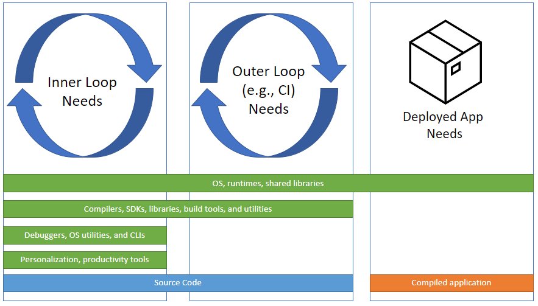

## <a href="#overview" name="overview" class="anchor"> What are development containers? </a>
As containerizing production workloads becomes commonplace, more developers are using containers for scenarios beyond deployment including continuous integration, test automation, and even full-featured coding environments.

Each scenario’s needs can vary between simple single container environments to complex, orchestrated multi-container setups. Rather than attempting to create another orchestrator format, the Development Containers Specification seeks to find ways to enrich existing formats with common development specific settings, tools, and configuration while still providing a simplified, un-orchestrated single container option – so that they can be used as coding environments or for continuous integration and testing.

Like the [Language Server Protocol](https://microsoft.github.io/language-server-protocol/) before it, the first format in the specification, [`devcontainer.json`](implementors/json_reference) was born out of necessity. It provided a way for tools to add needed configuration to develop inside of local or cloud-based containerized coding. Beyond repeatable setup, these same containers provide consistency to avoid environment specific problems across developers and centralized build and test automation services. The open-source CLI reference implementation can either be used directly or integrated into product experience to deliver these benefits. You can [learn more](supporting) about how other tools and services support this format.